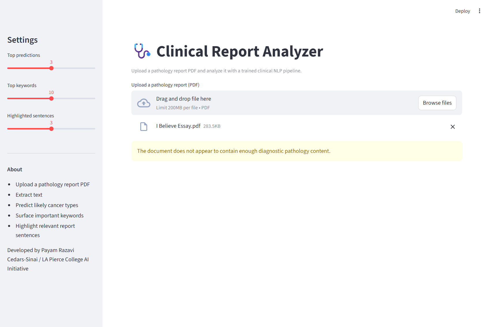
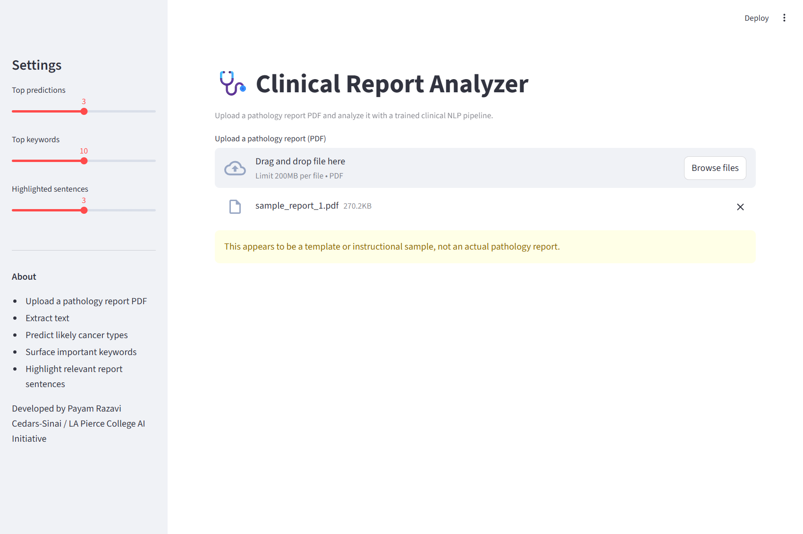
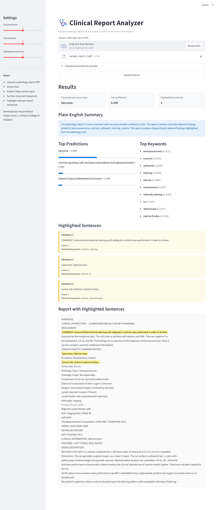
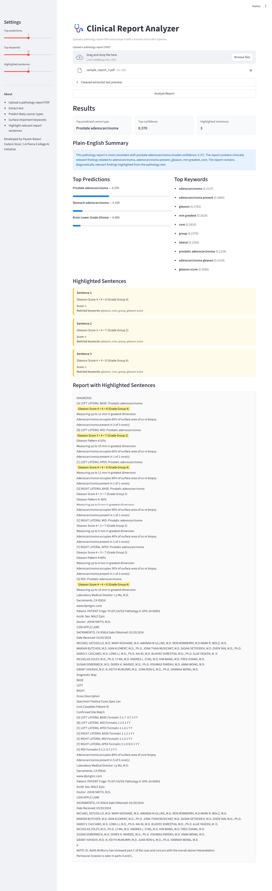

\# Clinical Report Analyzer


Developed by Payam Razavi


Clinical NLP pathology report analysis system developed through the  

Cedars-Sinai / Los Angeles Pierce College AI Initiative.


\---


\## Project Overview


This project explores the use of Natural Language Processing (NLP)  

and machine learning techniques for analyzing unstructured  

pathology reports and predicting likely cancer types from  

clinical text.


The system was designed as a two-phase pipeline:


\- Phase 1: Machine learning model development

\- Phase 2: Clinical pathology report analysis and deployment


The project includes preprocessing, TF-IDF feature engineering,  

machine learning classification, confidence scoring, keyword  

extraction, highlighted diagnostic evidence, PDF report handling,  

and plain-English report summarization.


\---


\## Key Features


\- Pathology report classification

\- TF-IDF text feature engineering

\- Multiple machine learning models

\- Confidence score generation

\- Important keyword extraction

\- Highlighted diagnostic sentences

\- Plain-English summaries

\- PDF pathology report support

\- Detection of invalid or template reports

\- Streamlit web interface


\---


\## Project Architecture


\### Phase 1 — Model Development


\- Preprocess clinical text

\- Generate TF-IDF features

\- Train multiple machine learning models

\- Evaluate model performance

\- Select best-performing model

\- Save trained model and vectorizer


Pipeline diagram:


!\[Phase 1 Pipeline](Phase1\_Model\_Development/phase1\_pipeline.png)


\---


\### Phase 2 — Clinical Report Analysis


\- Upload pathology report PDF

\- Extract and clean report text

\- Validate pathology-style content

\- Apply trained TF-IDF vectorizer

\- Predict likely cancer types

\- Generate explainability outputs


Pipeline diagram:


!\[Phase 2 Pipeline](Phase2\_Report\_Analysis/phase2\_pipeline.png)


\---


\## Explainability Features


The system provides several explainability mechanisms:


\- Top predicted cancer types

\- Confidence scores

\- Important keywords

\- Highlighted diagnostic sentences

\- Plain-English pathology summaries


These features help improve interpretability and transparency  

for clinical text analysis.


\---


\## Challenges Addressed


One major challenge involved handling inconsistent pathology  

report PDFs from different hospitals.


Custom preprocessing logic was added to:


\- remove headers and footers

\- reduce duplicated metadata

\- filter template/sample reports

\- reject irrelevant non-pathology documents

\- improve handling of image-heavy pathology reports


\---


\## Technologies Used


\- Python

\- scikit-learn

\- TF-IDF Vectorization

\- Streamlit

\- pandas

\- NumPy

\- PyPDF2

\- joblib


\---


\## Running the Application


```bash

cd Phase2_Report_Analysis
streamlit run app.py

```


\---


\## Project Structure


```text

Clinical_Report_Analyzer/

├── README.md
├── requirements.txt
├── .gitignore
├── LICENSE
│
├── screenshots/
│   ├── essay_rejection.png
│   ├── template_rejection.png
│   ├── pathology_prediction.png
│   └── image_based_report.png
│
├── Phase1_Model_Development/
└── Phase2_Report_Analysis/

```


\---


---

## Example Outputs

### Irrelevant Document Rejection


### Template Pathology Detection


### Clinical Pathology Prediction


### Image-Heavy Pathology Report Handling



\## Future Improvements


\- Deep learning models (BioBERT / ClinicalBERT)

\- OCR optimization for scanned pathology reports

\- Named entity recognition (NER)

\- Multi-label cancer classification

\- Improved image-heavy PDF extraction


\---


\## Disclaimer


This project is intended for educational and research purposes only.  

It is not intended for clinical diagnosis or medical decision-making.

